# GS-ELS-Group3 (Group 3) Technical Documentation

---

## 0. Documentation Outline

This document is intentionally structured in two stages:

1. **Outline (this section)** for quick navigation.
2. **Detailed narrative** (Word-document style) for each area.

### 0.1 Sections

1. Executive Summary  
2. System Context and Architecture  
3. Frontend (Angular) Technical Documentation  
4. Backend (Spring Boot Java) Technical Documentation  
5. MCP Server (FastMCP Python) Technical Documentation  
6. Database (PostgreSQL on Google Cloud) Technical Documentation  
7. End-to-End Flows and Sequence Diagrams  
8. API Surface (Backend + MCP Tooling)  
9. Build, Run, Test, and Deployment  
10. Security, Risks, and Hardening Roadmap  
11. Observability and Operational Guidance  
12. Appendix (tables, checklists, and quick references)  
13. Evidence and Validation Portfolio (Postman, pgAdmin, Google Cloud)

### 0.2 Diagram Index

This document includes multiple Mermaid diagrams:

- **High-level component architecture** (flowchart).
- **Layered architecture view** (flowchart).
- **Frontend authentication + backend sync sequence**.
- **Chat request sequence** (matching your attached style).
- **Authentication and user sync sequence**.
- **Calculation + save flow**.
- **Portfolio management flow**.
- **Database ERD**.
- **Deployment topology**.
- **Frontend route access state diagram**.
- **Evidence traceability diagram**.

---

## 1. Executive Summary

GS-ELS-Group3 (Group 3) is an educational investment analysis platform built around three cooperating services:

- **Angular frontend** for user experience, Firebase login, calculator UX, portfolio UI, and chatbot interface.
- **Spring Boot backend** as the business core for APIs, projection/simulation math, persistence, auth verification, and AI orchestration.
- **FastMCP server** as the tool-execution layer used by the backend chat model for structured retrieval and action calls.

The platform persists application data in **PostgreSQL** (schema managed via **Flyway migrations**), verifies identity through **Firebase Admin**, and uses external market data (Newton APIs) for beta/return calculations.

---

## 2. System Context and Architecture

### 2.1 Whole-Project Overview

GS-ELS-Group3 (Group 3) follows a layered architecture with clear ownership boundaries:

- **Presentation Layer (Angular)**: routing, UI rendering, auth UX, and API orchestration.
- **Application Layer (Spring Boot)**: business logic, validation, authorization checks, domain workflows, and response shaping.
- **Tooling Layer (FastMCP)**: structured tool interface for AI-driven workflows.
- **Data Layer (PostgreSQL on Google Cloud)**: system of record for users, calculations, funds, and portfolios.

Authentication is handled by Firebase (identity provider), while the backend and PostgreSQL remain the authoritative source for application data.

### 2.2 Runtime Context Narrative

1. User interacts with Angular routes (`/`, `/auth`, `/dashboard/*`).
2. Frontend authenticates through Firebase and receives an ID token.
3. Frontend calls Spring Boot APIs under `/api/*` (direct or via local dev proxy).
4. Spring Boot verifies auth tokens, executes business logic, and reads/writes PostgreSQL.
5. For chat, Spring Boot uses OpenAI (Spring AI) and executes tool calls through FastMCP.
6. FastMCP tools call backend REST APIs and return normalized tool results.

### 2.3 High-Level Architecture Diagram

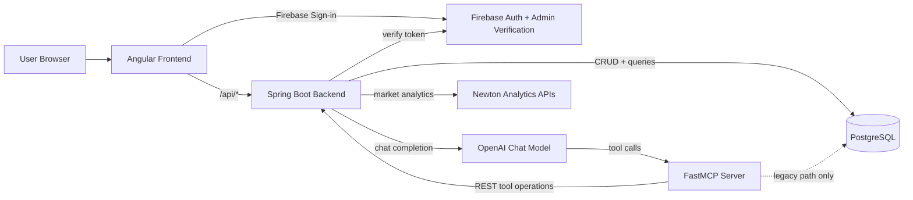

### 2.4 Layered Architecture View

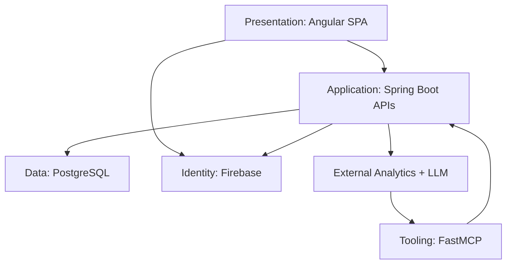

### 2.5 Service Responsibility Matrix

- **Angular frontend**: standalone components, route guards, Firebase session handling, request composition, user-focused error handling.
- **Spring Boot backend**: endpoint contract, request validation, UID ownership checks, projection/portfolio/chat orchestration, export generation.
- **FastMCP server**: tool registration, input normalization, backend API invocation, tool-safe response handling.
- **PostgreSQL**: relational persistence with Flyway-managed schema and UID-scoped data ownership.
- **Google Cloud runtime**: infrastructure hosting context for database and deployed services.

---

## 3. Frontend (Angular) Technical Documentation

### 3.1 Frontend Overview

The frontend is a single-page Angular application that manages navigation, authentication UX, and feature interaction for calculator, portfolios, and chat.

Separation of concerns:

- **Firebase Auth** identifies the user (login, signup, Google sign-in).
- **Spring Boot + PostgreSQL** remains the source of truth for business data.
- **Angular frontend** handles presentation, route protection, and request orchestration.

Primary user journey:

- Public landing page -> authentication -> protected dashboard.
- Authenticated users can run projections/simulations, manage portfolios, and use the chatbot.

### 3.2 Technology Stack

- Framework: Angular `21.1.5` with standalone components.
- Language: TypeScript.
- Routing: Angular Router with functional guards.
- Auth: `@angular/fire` + Firebase Authentication.
- HTTP: Angular `HttpClient` with `withFetch()`.
- Reactive model: Angular signals (`signal`, `effect`) plus RxJS streams.
- Runtime/build: Angular CLI (`@angular/build`) with SSR-capable output mode and Express server entry.
- Dev proxy: `/api/*` forwarded to `http://127.0.0.1:8080` via `proxy.conf.json`.

### 3.3 Frontend Project Structure

Frontend root: `frontend/`

Key files:

- `frontend/package.json`: scripts, Angular/Firebase dependencies.
- `frontend/angular.json`: build/serve/test targets, SSR output mode, proxy config.
- `frontend/src/main.ts`: browser bootstrap entrypoint.
- `frontend/src/app/app.config.ts`: providers for router, hydration, Firebase app/auth, and HttpClient.
- `frontend/src/app/app.routes.ts`: route table and guard bindings.
- `frontend/src/app/app.ts`: root component, router outlet, floating chatbot visibility control.
- `frontend/src/app/core/auth.facade.ts`: Firebase auth facade + optional backend sync.
- `frontend/src/app/core/auth.guards.ts`: `authGuard` and `publicOnlyGuard`.
- `frontend/src/environment.ts`: `apiBaseUrl` and `enableBackendAuthSync`.
- `frontend/src/firebase-config.ts`: Firebase project configuration.
- `frontend/proxy.conf.json`: local `/api` proxy target.

Feature modules under `frontend/src/app/pages/`:

- `landing`
- `auth-page`
- `dashboard-shell`
- `dashboard-home`
- `calculator`
- `portfolios`
- `chatbot`

### 3.4 Routing and Access Control

Public-only routes (`publicOnlyGuard`):

- `/`
- `/auth`

Protected routes (`authGuard`):

- `/dashboard`
- `/dashboard/calculator`
- `/dashboard/portfolios`

Fallback:

- `**` -> `/`

### 3.5 Frontend Route Access State Diagram

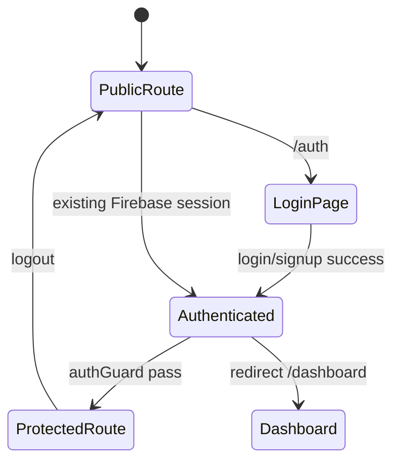

### 3.6 Authentication and Backend Sync Flow

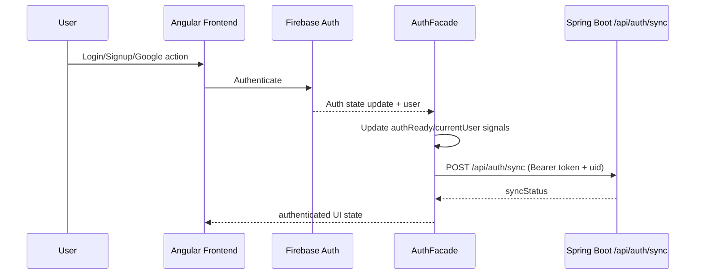

### 3.7 Feature Responsibilities

- **Landing**: public-facing introduction and pre-auth experience.
- **Auth page**: email/password and Google sign-in flows with Firebase error handling.
- **Dashboard shell**: protected navigation, user identity display, logout action.
- **Calculator**:
  - projection and compare modes,
  - deterministic and Monte Carlo views,
  - shorthand amount parsing (`k/m/b`),
  - saved calculations integration.
- **Portfolios**:
  - portfolio CRUD,
  - add/remove calculation links,
  - available-calculation lookup,
  - AI portfolio generation and simulation handoff.
- **Chatbot**:
  - floating UI component,
  - per-user local storage history (`chat_history_<uid>`, capped to last 10),
  - backend chat API call with request timeout handling.

### 3.8 Frontend API Integration Map

Authentication:

- `POST /api/auth/sync`

Calculator and funds:

- `POST /api/calculator/project`
- `GET /api/funds`
- `POST /api/monte-carlo`
- `POST /api/monte-carlo/portfolio`

Saved calculations:

- `GET /api/calculations`
- `POST /api/calculations`
- `DELETE /api/calculations/{id}`

Portfolios:

- `GET /api/portfolios`
- `POST /api/portfolios`
- `GET /api/portfolios/{name}`
- `PATCH /api/portfolios/{name}`
- `DELETE /api/portfolios/{name}`
- `PUT /api/portfolios/{name}/items/{calculationId}`
- `DELETE /api/portfolios/{name}/items/{calculationId}`
- `GET /api/portfolios/{name}/available-calculations`
- `POST /api/ai-portfolio/generate`

Chat:

- `POST /api/chat`

### 3.9 Frontend Build, Run, and Configuration

Prerequisites:

- Node.js compatible with Angular 21 (Node `20.19+` or `22.12+`).
- npm (project uses `npm@11.10.0`).
- Backend running at `http://127.0.0.1:8080` for API-backed features.

Local startup:

```bash
cd frontend
npm install
npm start
```

Important scripts:

- `npm start` / `npm run dev`: run dev server.
- `npm run build`: production build.
- `npm run watch`: development build watch mode.
- `npm test`: frontend unit tests.

### 3.10 Frontend Reliability Notes

- Route guards control navigation but do not replace backend auth verification.
- Backend remains responsible for token verification and UID-scoped authorization.
- Dev proxy (`proxy.conf.json`) removes local CORS friction for `/api/*`.
- Chat and simulation calls use request timeouts to avoid indefinite loading states.

---

## 4. Backend (Spring Boot Java) Technical Documentation

### 4.1 Stack and Runtime

- Java 17.
- Spring Boot 3.5.2.
- Spring Web + JDBC.
- Flyway for migration lifecycle.
- Spring AI (OpenAI model + MCP client).
- Firebase Admin SDK.
- Apache POI for Excel export.

### 4.2 Package Architecture

- `controller`: API contract and transport-level validation.
- `service`: computations, integration orchestration, export construction.
- `database`: SQL repositories with `JdbcTemplate`.
- `dto`: typed request/response records.
- `config`: startup infra beans (Flyway).

### 4.3 Backend Component Diagram

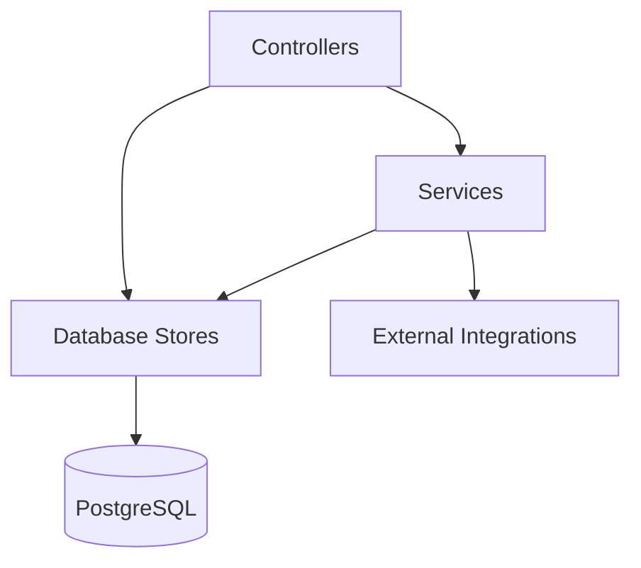

### 4.4 Config and Feature Flags

Key runtime properties:

- `server.port`
- `app.frontend-origin`
- `app.chat.enabled`
- `spring.datasource.*`
- `spring.flyway.*`
- `spring.ai.openai.*`
- `spring.ai.mcp.client.*`
- `firebase.credentials.path` / `firebase.credentials.json-base64`

Profile:

- `application-local.properties` disables MCP client and `/api/chat`.

### 4.5 API Domains

1. **Auth**: `/api/auth/sync`
2. **Calculator**: `/api/calculator/project`
3. **Saved Calculations**:
   - `/api/calculations`
   - `/api/saved-calculations`
4. **Portfolios**: `/api/portfolios` and item subroutes
5. **Funds**: `/api/funds`
6. **Monte Carlo**: `/api/monte-carlo` and `/api/monte-carlo/portfolio`
7. **AI Portfolio**: `/api/ai-portfolio/generate`
8. **Chat**: `/api/chat`
9. **Exports**: `/api/exports/excel`

### 4.6 Core Math and Domain Logic

Projection logic uses:

- risk-free rate `rf = 0.04`
- `beta` from Newton beta API.
- expected return from Newton historical price delta.
- CAPM-style annualized rate:
  - `r = rf + beta * (expectedReturn - rf)`
  - clamped to at least `rf` in `FutureValueService`.
- future value:
  - `FV = principal * exp(r * years)`

Time series:

- yearly points from 0..20 in saved calculations workflows.

Monte Carlo:

- random expected return sampling around historical mean.
- percentile outputs and risk metrics.
- single asset and weighted portfolio modes.

### 4.7 Chat + Tool Calling Model

- `/api/chat` validates request (`message`, `uid` required).
- Builds system prompt with explicit tool usage rules.
- Invokes Spring AI chat client.
- Tool callbacks go through SyncMcpToolCallbackProvider.
- Retries timeout failures once.

---

## 5. MCP Server (FastMCP Python) Technical Documentation

### 5.1 Runtime Contract

FastMCP exposes:

- `/health` (custom route).
- `/mcp` (default MCP endpoint path, configurable).

Security behavior:

- localhost-safe default bind (`127.0.0.1`).
- token required for public bind unless explicit override.
- accepted credentials:
  - Authorization Bearer
  - X-MCP-Token
  - query `mcp_token`

### 5.2 MCP Tool Ecosystem

Registered tool groups:

- auth tools
- calculation tools
- fund tools
- portfolio tools
- recommendation tools
- AI portfolio tools
- health tools
- chat echo tool

Most tools:

- validate inputs.
- call backend HTTP APIs with `BackendClient`.
- normalize response payload.

### 5.3 MCP Internal Service Diagram

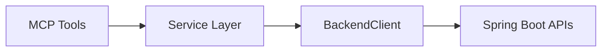

### 5.4 Legacy Direct DB Path

- Direct DB utility exists.
- Legacy saved-calculation DB tool exists but is not registered in current server bootstrap.
- Operationally, active path is MCP -> backend APIs.

---

## 6. Database (PostgreSQL on Google Cloud) Technical Documentation

### 6.1 Persistence Role

PostgreSQL stores all application domain records:

- users
- saved calculations
- mutual fund catalog
- portfolios
- portfolio-item links

### 6.2 Schema Evolution

Managed by Flyway migrations V1 to V11.

- Initial core entities: users, saved_calculations.
- Precision adjustments.
- Funds catalog table + seed records.
- Portfolios and portfolio_items.
- Uniqueness constraints evolution for portfolio names.
- Additional fields (`name`, `time_series`) on saved calculations.

### 6.3 ER Diagram

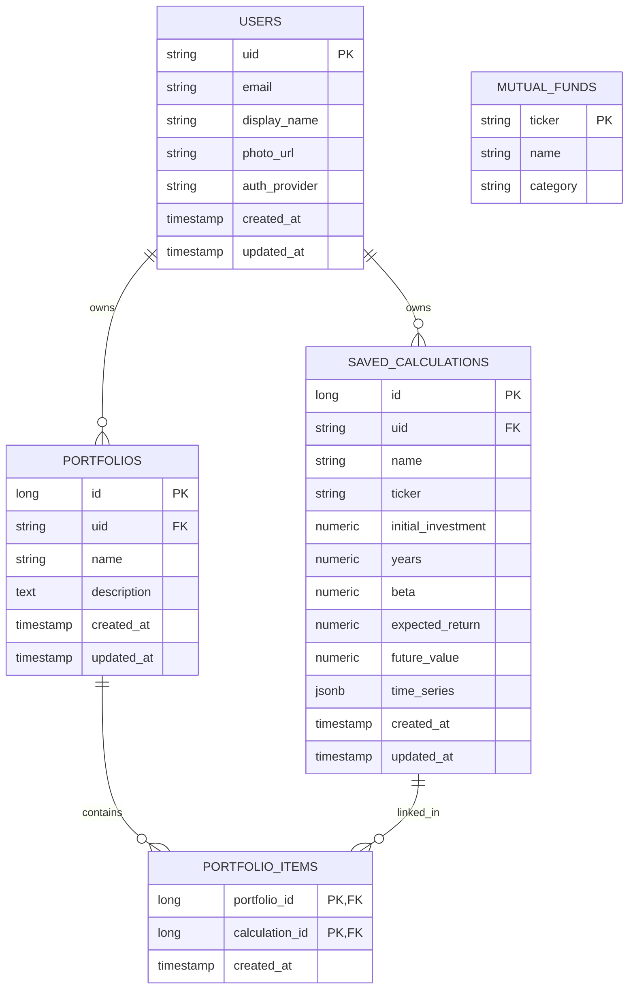

### 6.4 Data Integrity Notes

- User ownership is enforced by UID-scoped queries.
- FKs cascade on delete where appropriate.
- Portfolio name uniqueness is case-insensitive per user.
- `time_series` stored as JSONB for flexible yearly projections.

---

## 7. End-to-End Flows and Sequence Diagrams

### 7.1 Chat Request Sequence Diagram (Reference-Style)

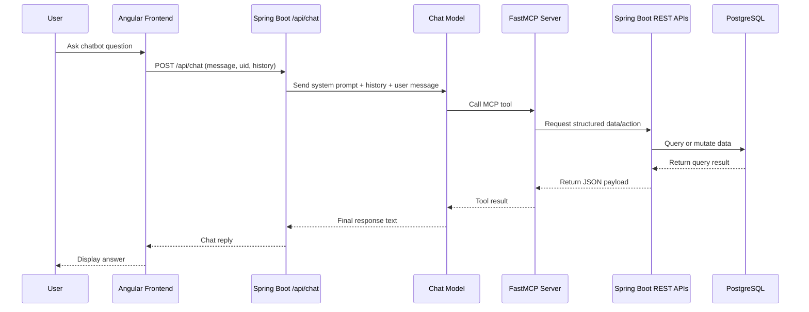

### 7.2 Authentication + User Sync Sequence

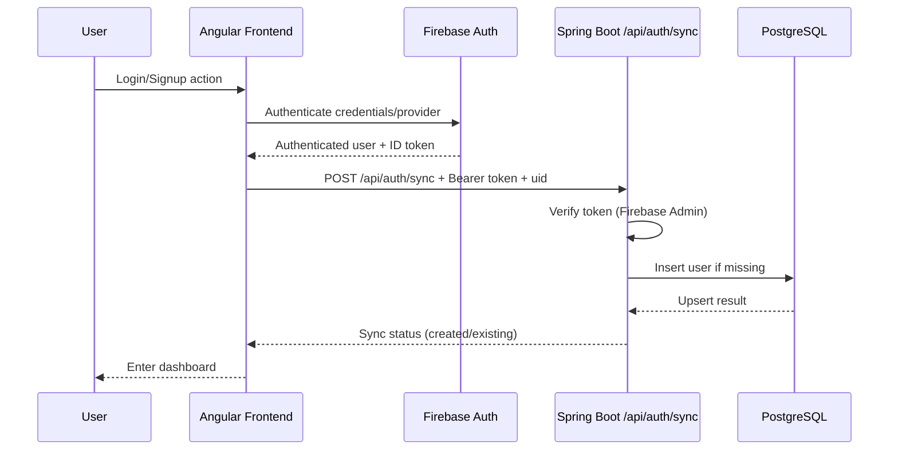

### 7.3 Calculator + Save Flow

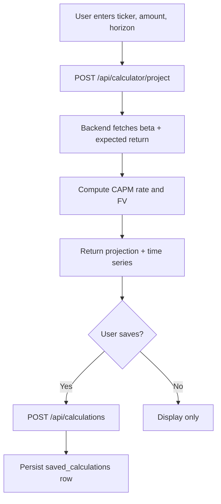

### 7.4 Portfolio Management Flow

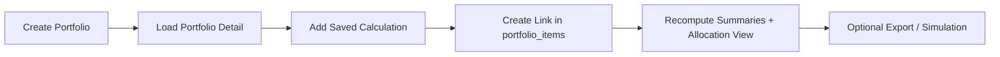

---

## 8. API Surface and MCP Tool Surface

### 8.1 Backend Endpoint Inventory (Condensed)

- `POST /api/auth/sync`
- `POST /api/calculator/project`
- `GET|POST /api/calculations`
- `PUT|DELETE /api/calculations/{id}`
- `GET /api/saved-calculations`
- `PATCH|DELETE /api/saved-calculations/{id}`
- `GET|POST /api/portfolios`
- `GET|PATCH|DELETE /api/portfolios/{name}`
- `GET /api/portfolios/{name}/items`
- `PUT|DELETE /api/portfolios/{name}/items/{calculationId}`
- `GET /api/portfolios/{name}/available-calculations`
- `GET /api/funds`
- `GET /api/funds/{ticker}`
- `POST /api/monte-carlo`
- `POST /api/monte-carlo/portfolio`
- `POST /api/ai-portfolio/generate`
- `POST /api/exports/excel`
- `POST /api/chat` (feature-flagged)

### 8.2 MCP Tool Inventory (Registered)

- `auth_sync`
- `health_check`
- `chat_echo`
- `funds_list`, `fund_detail`
- `compare_funds`, `funds_suggest_by_goal`, `suggest_alternative_funds`, `funds_projection_recommendations`
- `saved_calculations_list`, `calculations_list`, `saved_calculation_detail`, `saved_calculation_time_series`, `saved_calculations_compare`
- `project_calculation`, `saved_calculation_create`, `saved_calculation_update`, `saved_calculation_delete`
- `saved_calculation_update_with_auth`, `saved_calculation_delete_with_auth`
- `monte_carlo_simulation`
- `portfolio_list`, `portfolio_detail`, `portfolio_items`, `portfolio_create`, `portfolio_update`, `portfolio_delete`
- `portfolio_add_item`, `portfolio_remove_item`, `portfolio_available_calculations`, `portfolio_total_investment`
- `ai_portfolio_generator`

---

## 9. Build, Run, Test, and Deployment

### 9.1 Local Build and Run

Backend:

```bash
cd backend/backend
./mvnw spring-boot:run
```

MCP server:

```bash
cd mcp_server
python3 -m venv .venv
source .venv/bin/activate
pip install -r requirements.txt
python3 server.py
```

Frontend:

```bash
cd frontend
npm install
npm start
```

### 9.2 Test Commands

Backend unit tests:

```bash
cd backend/backend
./mvnw test
```

Backend integration tests:

```bash
RUN_INTEGRATION=true DB_URL=... DB_USERNAME=... DB_PASSWORD=... \
./mvnw -Dspring.profiles.active=integration test
```

MCP tests:

```bash
cd mcp_server
pip install -r requirements-dev.txt
pytest -q
```

Frontend tests:

```bash
cd frontend
npm test
```

### 9.3 Deployment Topology Diagram

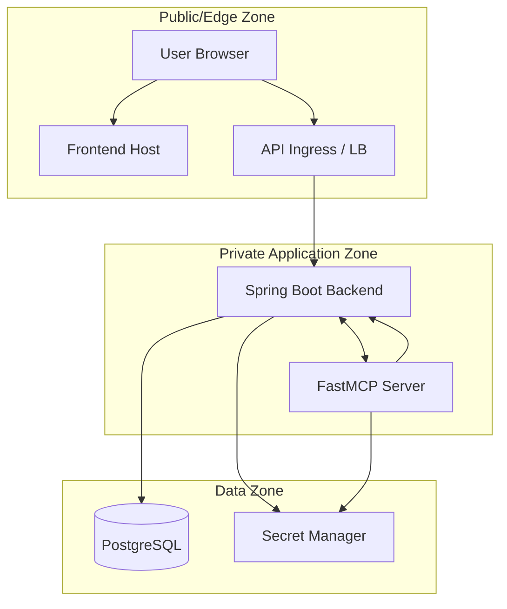

---

## 10. Security, Risks, and Hardening Roadmap

### 10.1 Current Controls

- Firebase token verification in backend auth flows.
- MCP endpoint token middleware and public-bind protection.
- Server-side UID ownership checks in SQL access methods.
- Default hidden backend exception messages to clients.

### 10.2 Known Risks

- Secrets currently present in local env files in the repo workspace.
- Mixed identity model on some endpoints (UID fallback without strict token-only enforcement).
- Some GET patterns depend on request body payloads, which are non-standard.
- MCP dependencies are not fully pinned.

### 10.3 Hardening Roadmap

1. Rotate and remove exposed secrets immediately.
2. Enforce strict token-required auth on all data mutating/reading user-scoped APIs.
3. Remove GET-with-body reliance.
4. Add dependency lock strategy for MCP.
5. Add API gateway auth/rate limiting and observability controls.

---

## 11. Observability and Operational Guidance

### 11.1 Operational Metrics

- Request rate, p95 latency, and error rate for:
  - `/api/chat`
  - `/api/calculator/project`
  - `/api/portfolios*`
  - `/api/calculations*`
- MCP tool call count, success/failure, timeout rates.
- Newton API failure and timeout rates.
- DB query latency and connection saturation.

### 11.2 Operational Logs

- Structured JSON logs with request ID and user UID (where legal/compliant).
- Correlate chat request -> tool calls -> backend API subcalls.

### 11.3 Runbook Notes

- If chat fails:
  - verify OpenAI key.
  - verify MCP server reachable.
  - verify backend MCP endpoint config.
- If calculators fail:
  - verify Newton API reachability.
  - check backend timeout and downstream status.
- If portfolio/load hangs:
  - verify DB connectivity and query latency.

---

## 12. Appendix

### 12.1 Environment Variable Groups

Frontend:

- `apiBaseUrl`
- `enableBackendAuthSync`

Backend:

- `DB_URL`, `DB_USERNAME`, `DB_PASSWORD`
- `OPENAI_API_KEY`
- `FIREBASE_CREDENTIALS` or `FIREBASE_CREDENTIALS_JSON_BASE64`
- `MCP_SERVER_ORIGIN`, `MCP_SERVER_ENDPOINT`
- `APP_CHAT_ENABLED`

MCP:

- `MCP_HOST`, `MCP_PORT`, `MCP_PATH`
- `MCP_AUTH_TOKEN`
- `ALLOW_INSECURE_PUBLIC_BIND`
- `BACKEND_BASE_URL`, `BACKEND_TIMEOUT_SECONDS`
- DB settings (`DATABASE_URL` or JDBC triple)

### 12.2 Notes on Diagram Portability

If you want Lucidchart versions:

1. Use these Mermaid blocks directly in Markdown-enabled viewers, or
2. Convert via Mermaid Live Editor export and import into Lucidchart as image/SVG, or
3. Rebuild one-to-one in Lucidchart using the same participant/component names included in this doc.

---

## 13. Evidence and Validation Portfolio (Postman, pgAdmin, Google Cloud)

This section is intentionally broad and submission-ready so you can prove implementation quality with visual evidence.

### 13.1 Goal of the Evidence Section

Use this section to show:

- Functional correctness (API requests/responses are working).
- Data correctness (records are truly persisted and linked in PostgreSQL).
- Infrastructure correctness (services and database are deployed/running in Google Cloud context).
- End-to-end consistency (same UID/entity appears across API, DB, and cloud runtime).

### 13.2 Evidence Folder Structure

All evidence screenshots for this submission are stored in the project root and referenced directly in this document.

Current evidence file mapping:

- `img.png` -> Postman API evidence
- `img_3.png` -> pgAdmin database evidence
- `img_2.png` -> Google Cloud deployment/runtime evidence
- `img_1.png`, `img_4.png`, `img_5.png`, `img_6.png` -> GitKraken collaboration evidence

This naming is intentional for final submission consistency with the uploaded repository assets.

### 13.3 Evidence Traceability Diagram

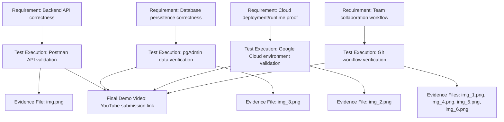

Interpretation:

- `img.png` provides consolidated API-level execution evidence (representative Postman proof).
- `img_3.png` provides PostgreSQL data-state verification evidence.
- `img_2.png` provides cloud runtime/deployment evidence.
- `img_1.png`, `img_4.png`, `img_5.png`, and `img_6.png` provide collaboration and integration workflow evidence.
- Complete endpoint execution is additionally demonstrated in the final submission video and validated through corresponding database/cloud evidence.

### 13.4 Postman Evidence Pack (Detailed)

For the submitted Postman screenshot, ensure the following are visible:

1. Method and endpoint visible.
2. Request headers/body visible.
3. Response status and response body visible.
4. Timestamp/environment (if possible) visible.
5. Correlation key visible (UID, portfolio name, calculation ID, export filename).

#### 13.4.1 API Coverage Validated During Testing

The following endpoints/features were tested and confirmed working.  
The single submitted Postman screenshot is representative evidence, and full execution coverage is supported by the demo video plus pgAdmin/Google Cloud validation.

- Auth sync success (`POST /api/auth/sync`, 200).
- Calculator projection (`POST /api/calculator/project`, 200).
- Saved calculation create/list/update/delete.
- Portfolio create/list/detail/update/delete.
- Portfolio add item and remove item.
- Available calculations endpoint.
- Funds list and fund detail.
- Monte Carlo single and portfolio modes.
- AI portfolio generate.
- Export Excel scopes (`calculations`, `portfolio`, `all`).
- Chat endpoint success path (or controlled failure path with explanation).

#### 13.4.2 Postman Caption (Submitted Evidence)

**Figure P-01. Consolidated Postman API Validation**:  
The Postman screenshot shows a successful API execution (`200 OK`) with request and response details visible.  
This figure is submitted as representative API evidence, while complete endpoint coverage is demonstrated in the final demo video and cross-validated through pgAdmin and Google Cloud evidence.

#### 13.4.3 Postman Figure Blocks

#### Figure P-01: Saved Calculations List
<!-- Paste image here -->
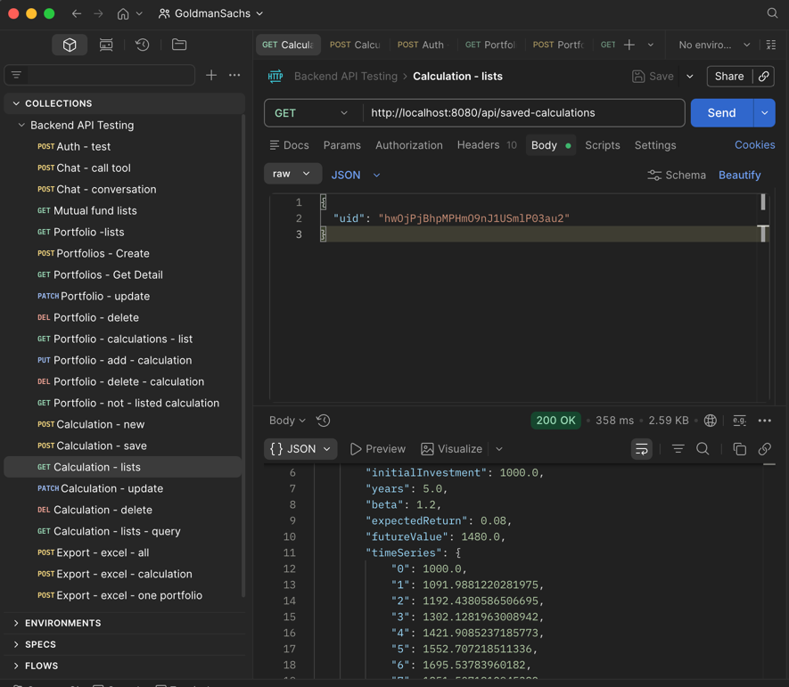
Observed Result: 200 OK from GET /api/saved-calculations, returning calculation rows for the provided uid.
Validation: Confirms saved calculation retrieval flow and uid-scoped data access from backend to PostgreSQL.

### 13.5 pgAdmin Evidence Pack (Detailed)

For pgAdmin screenshots, capture both structure and data state.

#### 13.5.1 Structure Evidence

Show:

- Database tree with schema and relevant tables.
- Key columns in:
  - `users`
  - `saved_calculations`
  - `portfolios`
  - `portfolio_items`
  - `mutual_funds`
- Constraints/indexes (especially UID FK relations and unique portfolio-name index).

#### 13.5.2 Data Evidence

Show query result grids proving:

- User row exists after auth sync.
- Saved calculation row exists after create.
- `time_series` JSONB populated.
- Portfolio row exists after create.
- Junction row in `portfolio_items` exists after add calculation.
- Row removed after delete/remove operations.

#### 13.5.3 SQL Snippets to Capture

```sql
-- Verify user sync
select uid, email, auth_provider, created_at
from users
where uid = '<TEST_UID>';

-- Verify saved calculations for test user
select id, uid, name, ticker, initial_investment, years, beta, expected_return, future_value, updated_at
from saved_calculations
where uid = '<TEST_UID>'
order by id desc;

-- Verify portfolio and links
select p.id, p.uid, p.name, p.description, p.updated_at
from portfolios p
where p.uid = '<TEST_UID>'
order by p.id desc;

select pi.portfolio_id, pi.calculation_id, pi.created_at
from portfolio_items pi
join portfolios p on p.id = pi.portfolio_id
where p.uid = '<TEST_UID>'
order by pi.created_at desc;
```

#### 13.5.4 pgAdmin Evidence Interpretation

The submitted pgAdmin evidence confirms that authenticated user records are persisted in PostgreSQL and available for query validation.  
This supports the backend claim that auth sync creates/maintains user rows in the `users` table.

#### 13.5.5 pgAdmin Figure Blocks

#### Figure DB-01: users Table Verification
<!-- Paste image here -->
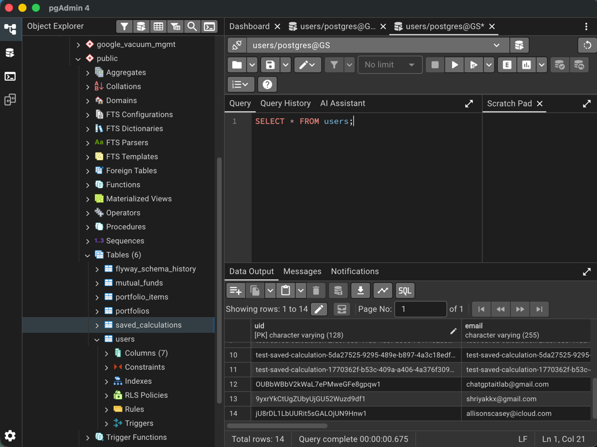
Observed Result: `SELECT * FROM users;` shows expected user rows created through auth sync flow.
Validation: Confirms Firebase-authenticated users are persisted in PostgreSQL users table.

### 13.6 Google Cloud Evidence Pack (Detailed)

Use this subsection to prove real cloud usage, not only local runs.

#### 13.6.1 What to Capture

- Project overview with project ID.
- Compute/hosting artifact for backend and/or MCP (VM, Cloud Run, or service host panel).
- Cloud SQL (or database host) instance overview page.
- Network/security configuration snapshot (redact sensitive details).
- Runtime logs/metrics page showing active requests (if available).

#### 13.6.2 Cloud Evidence Checklist

- Service endpoint or deployment target visible.
- Region/zone visible.
- Instance status (RUNNING/HEALTHY) visible.
- Recent activity logs visible (optional but strong evidence).
- Correlation with test time window visible.

#### 13.6.3 Google Cloud Caption (Submitted Evidence)

Figure `GC-01` caption: Google Cloud Deployment Context and Runtime Evidence.  
This caption applies to the screenshot shown in Section `13.6.4`.

#### 13.6.4 Google Cloud Figure Blocks

#### Figure GC-01: Google Cloud Deployment Context and Runtime Evidence
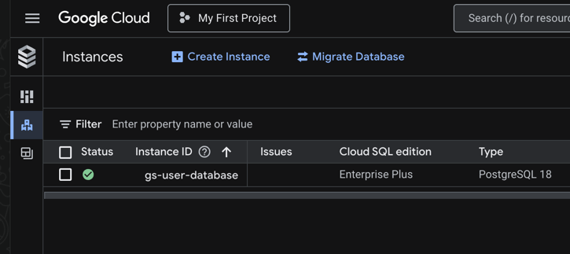
Observed Result: Screenshot shows the active Google Cloud project context, database runtime availability, and service activity evidence for the tested environment.
Validation: Confirms deployment ownership, infrastructure health, and operational execution evidence in one consolidated artifact.

### 13.7 GitKraken Collaboration Evidence

This subsection documents source-control execution and team collaboration history.

What this evidence proves:

- Branch-based development was used across frontend, backend, and MCP workstreams.
- Feature branches were merged into integration/mainline branches.
- Commit history reflects iterative implementation and fixes across the project lifecycle.
- Pull request and merge activity aligns with delivered features.

#### 13.7.1 GitKraken Figure Block

#### Figure GK-01: GitKraken Commit and Branch Graph
`GK-01` is documented using four screenshots in sequence:
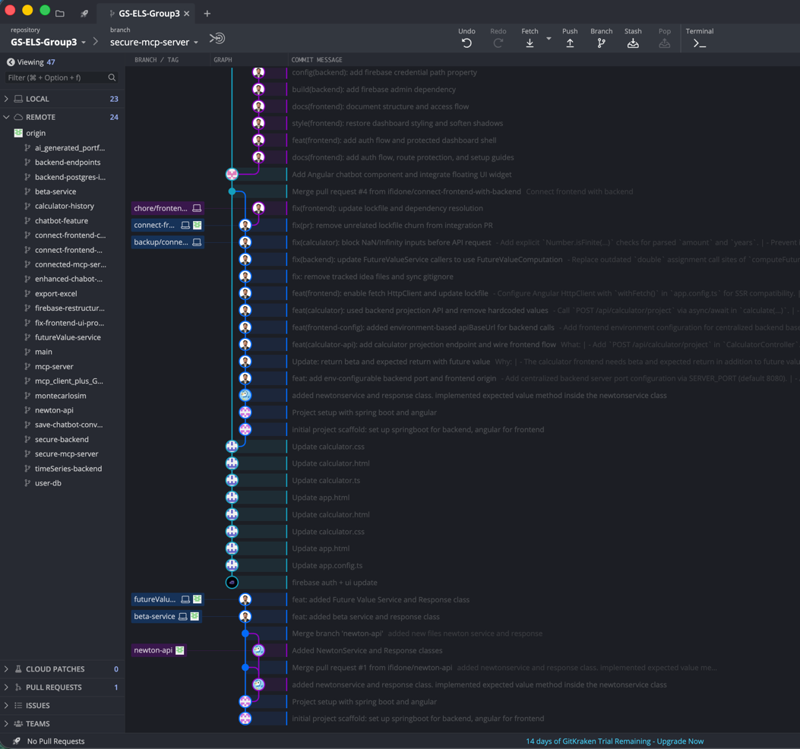
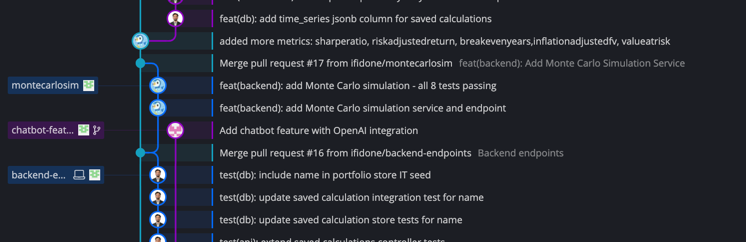
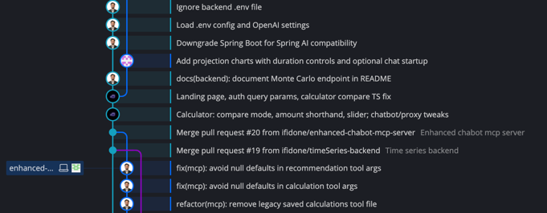
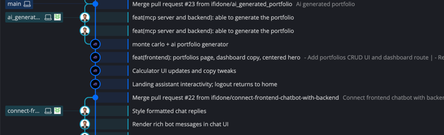
Observed Result: Branch graph shows feature branches, merge points, and commit progression for major modules.
Validation: Confirms active collaboration workflow, tracked change history, and integration discipline.

### 13.8 Evidence Mapping

- API execution evidence is provided by the consolidated Postman screenshot (`img.png`) and validated in the submission demo video.
- Database persistence evidence is provided by the pgAdmin screenshot (`img_3.png`) showing `users` table verification.
- Cloud deployment/runtime evidence is provided by the Google Cloud screenshot (`img_2.png`).
- Collaboration workflow evidence is provided by the GitKraken screenshots (`img_1.png`, `img_4.png`, `img_5.png`, `img_6.png`).


### 13.9 Final Validation Statement

The attached Postman, pgAdmin, Google Cloud, and GitKraken screenshots collectively demonstrate successful implementation, execution, collaboration, and persistence of major GS-ELS-Group3 (Group 3) workflows.  
Each evidence artifact is traceable to a specific test case and requirement, and results were validated against both API responses and database state.

Final submission demo video:  
https://www.youtube.com/watch?v=YFyNY46obnU
